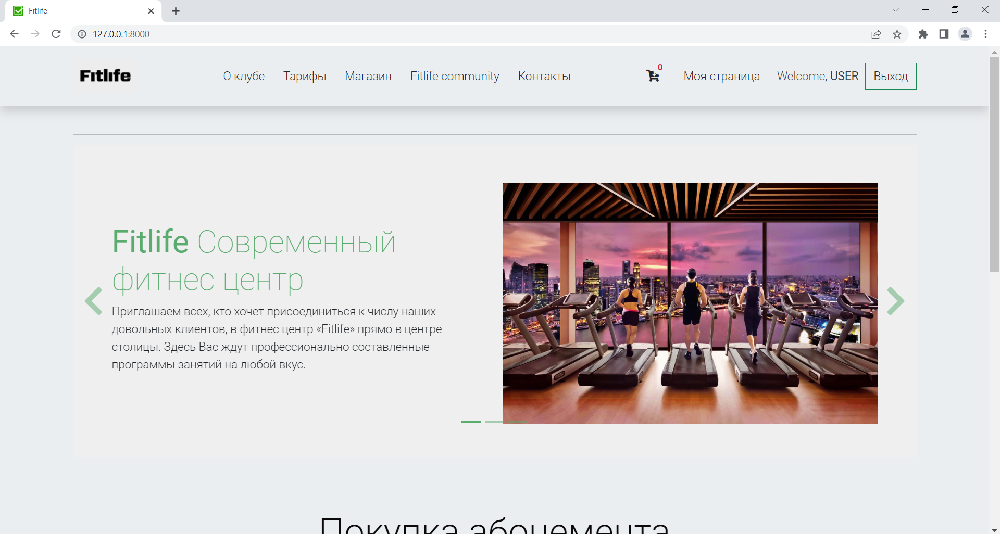
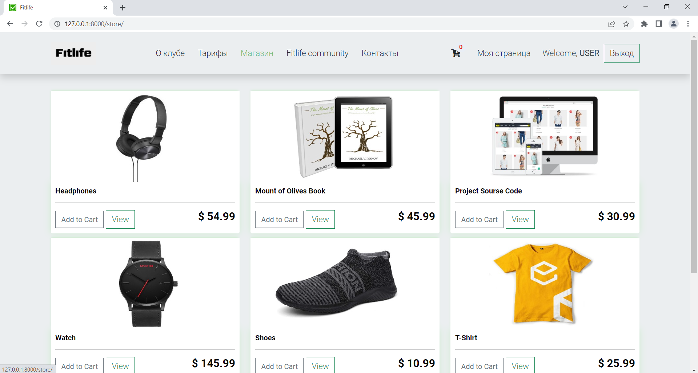
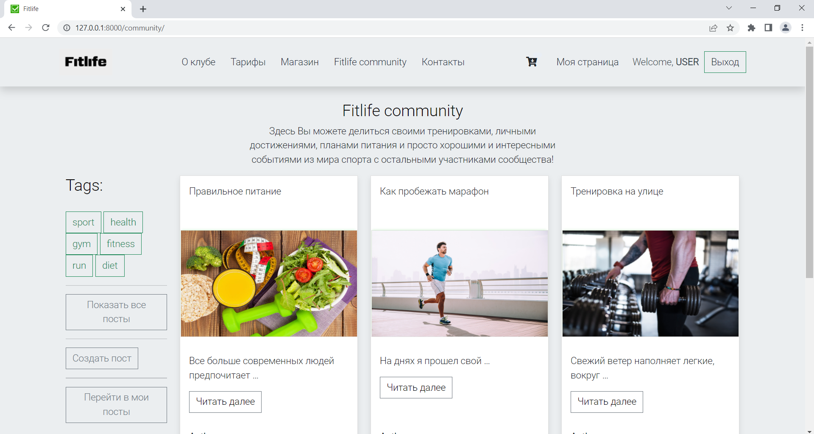
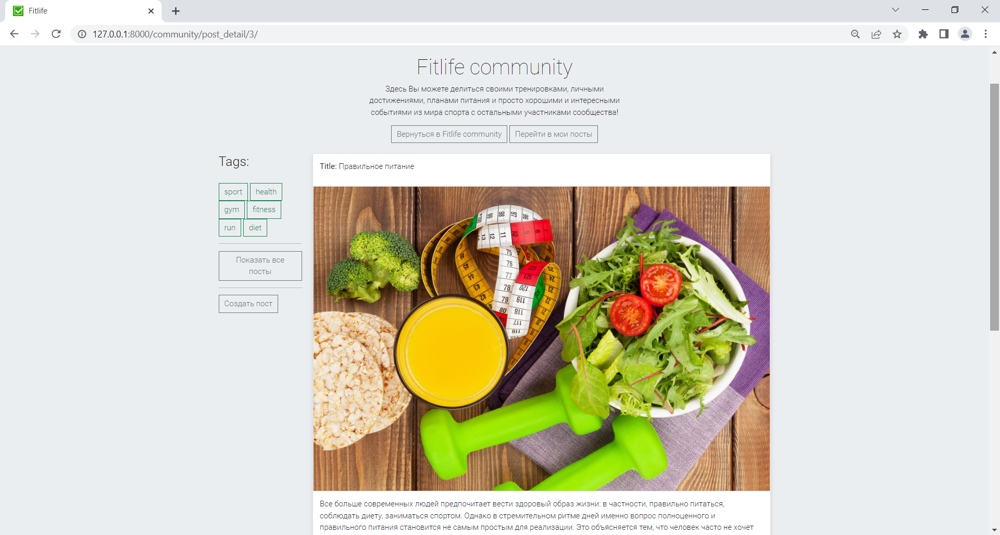
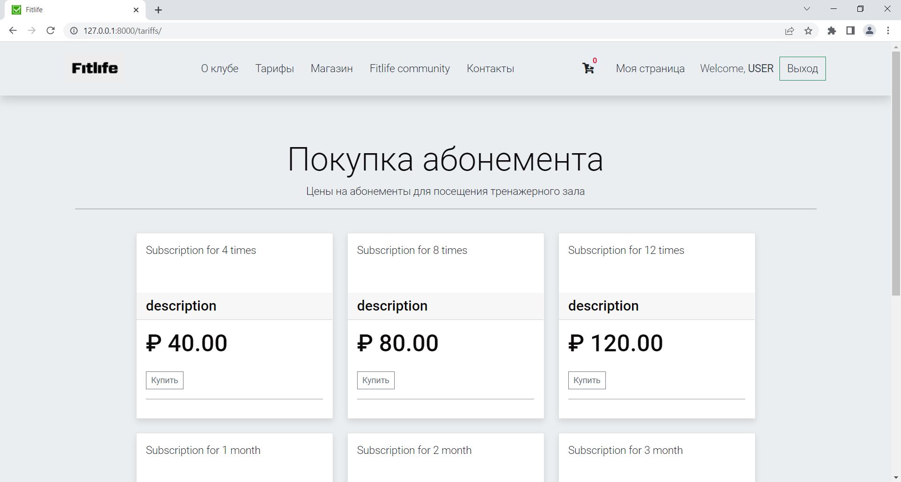

# Fitlife project

Website written in Django.

Source link: https://github.com/ArsenAjiev/fitlife

Requirements:

    Python 3.9, PostgreSQL 12, Django 4, 


## Overview

This web application is a site for a fitness center, 
where users can buy different types of memberships to visit the fitness center.

Buy sporting goods, view and comment on posts, and manage your accounts.

The main features that have currently been implemented are:

* Registration, authentication and authorization.
* Functionality of payment for the purchase of subscriptions.
* Functionality of payment for the purchase of goods in the store
* Admin users can create and manage models. The admin has been optimised.
* Adding posts and editing them

More information you can find in docs/ package:
* fitlife_project_TZ.md
* README_all.md


## Quick Start use sqlite3

To get this project up and running locally on your computer:
1. git clone https://github.com/ArsenAjiev/fitlife.git

```shell
   pip install -r requirements.txt
   python3 manage.py makemigrations
   python3 manage.py migrate
   python3 manage.py collectstatic
   python3 manage.py test 
   python3 manage.py createsuperuser 
```

2. Open a browser to `http://127.0.0.1:8000/admin/` to open the admin site  
 ```text
   
        - Create  "Customer"  in admin interface (for superuser)
        - Create  "Membership"  in admin interface (for superuser)
```
   
```shell
      # Create test product for store use management command.
      python3 manage.py create
      # Create test subscription use management command
      python3 manage.py create_sub
```
```shell
      python3 manage.py runserver

```
3. Open tab to `http://127.0.0.1:8000` to see the main site.


## Quick Start use docker

To get this project up and running locally on your computer:
1. git clone https://github.com/ArsenAjiev/fitlife.git

```shell
#Run all at once
docker-compose up -d --build --force-recreate
```

```shell
docker-compose exec app python3 manage.py createsuperuser
```

2. Open a browser to `http://127.0.0.1:8000/admin/` to open the admin site
 ```text
  
        - Create  "Customer"  in admin interface (for superuser)
        - Create  "Membership"  in admin interface (for superuser)
```
   
```shell
      # Create test product for store use management command.
      docker-compose exec app python3 manage.py create
      
      # Create test subscription use management command.
      docker-compose exec app python3 manage.py create_sub
```
3. Open tab to `http://127.0.0.1:8080` to see the main site, or use other port in your settings.


## Useful commands for docker 
```shell
# clear ALL data !!! 
docker system prune -a
docker volume prune

```
```shell
# show information 
docker ps -a
docker images
docker volume ls

```


1. Home

   
   
2. Shop

   

3. Blog - (community) 

   

4. Blog - (single post) 

   

5. Membership

   


